<!-- 
# InconSeg
The official pytorch implementation of InconSeg.

The code and dataset will be available upon acceptance of the paper. The following images are some samples of this dataset:

<div align=center>
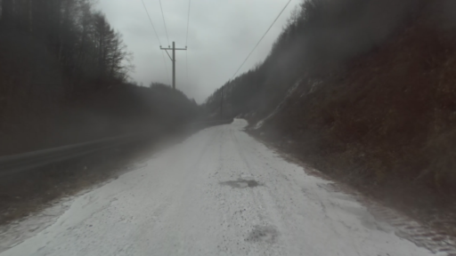 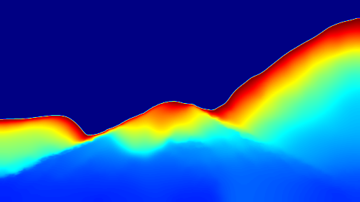 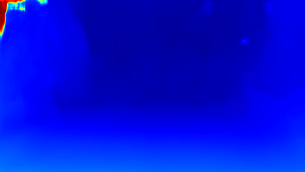 
  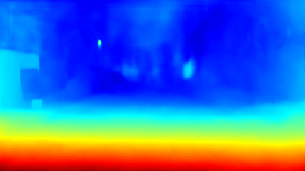 
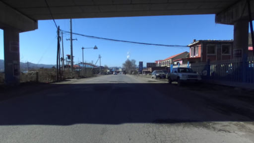 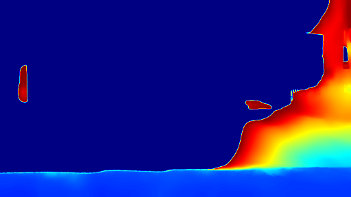  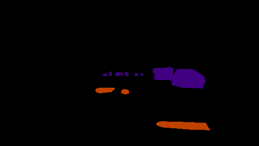
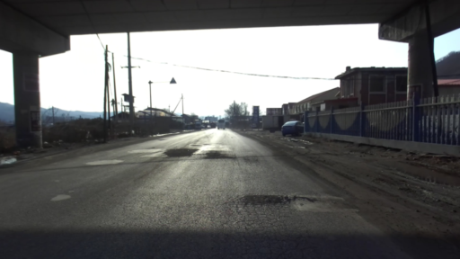   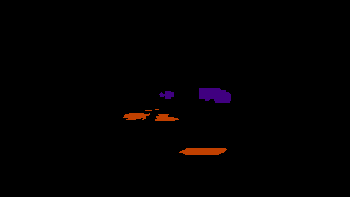
 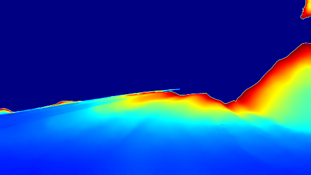  
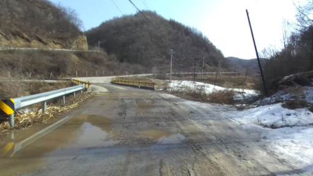  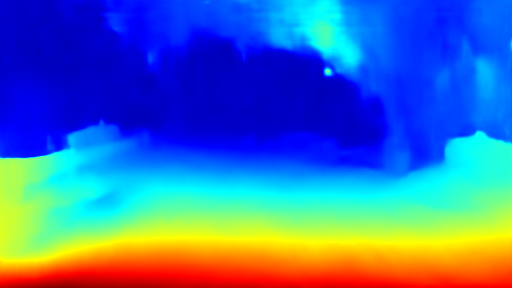 
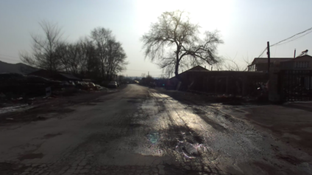 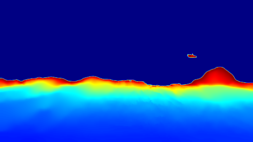 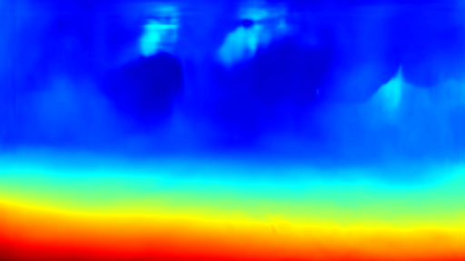 
 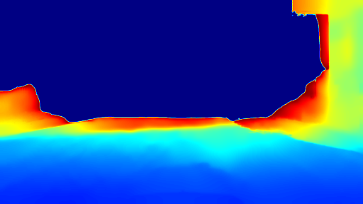 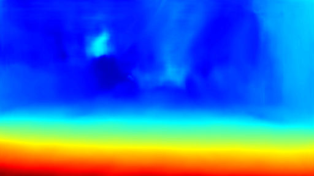 
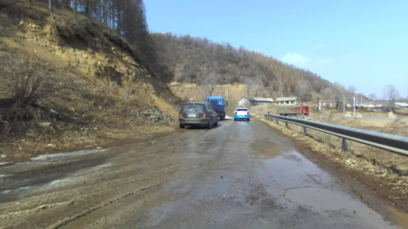   
</div>
-->


# InconSeg-PyTorch
The official pytorch implementation of **InconSeg: Residual-Guided Fusion With Inconsistent Multi-Modal Data for Negative and Positive Road Obstacles Segmentation**. ([RA-L](https://ieeexplore.ieee.org/document/10114585)). 

We test our code in Python 3.7, CUDA 11.1, cuDNN 8, and PyTorch 1.7.1. We provide `Dockerfile` to build the docker image we used. You can modify the `Dockerfile` as you want.  
<div align=center>

</div>

# Demo

The accompanied video can be found at: 
<div align=center>
<a href="https://www.youtube.com/watch?v=yoW52JeTDR8&t=7s">
</div>

# Introduction
InconSeg is a network for the segmentation of positive obstacles and negative obstacles which can address the inconsistent information between two modalities with Residual-Guided Fusion modules
# Dataset
The [NPO dataset](https://github.com/lab-sun/InconSeg/blob/main/docs/dataset.md) can be downloaded from here [page](https://labsun-me.polyu.edu.hk/zfeng/InconSeg/). You can also download the dataset from [Baidu Netdisk](https://pan.baidu.com/s/1oxUb-0vdiZzTPu4waci39g), the password is cekd


# Pretrained weights
The pretrained weight of InconSeg can be downloaded from [here](https://labsun-me.polyu.edu.hk/zfeng/InconSeg/). You can also download the dataset from [Baidu Netdisk](https://pan.baidu.com/s/1oxUb-0vdiZzTPu4waci39g), the password is cekd

# Usage
* Clone this repo
```
$ git clone https://github.com/lab-sun/InconSeg.git
```
* Build docker image
```
$ cd ~/InconSeg
$ docker build -t docker_image_inconseg .
```
* Download the dataset
```
$ (You should be in the InconSeg folder)
$ mkdir ./dataset
$ cd ./dataset
$ (download our preprocessed dataset.zip in this folder)
$ unzip -d . dataset.zip
```
* To reproduce our results, you need to download our pretrained weights.
```
$ (You should be in the InconSeg folder)
$ mkdir ./weights_backup
$ cd ./weights_backup
$ (download our preprocessed weights.zip in this folder)
$ unzip -d . weights.zip
$ docker run -it --shm-size 8G -p 1234:6006 --name docker_container_inconseg --gpus all -v ~/InconSeg:/workspace docker_image_inconseg
$ (currently, you should be in the docker)
$ cd /workspace
$ (To reproduce the results of RGB & Depth)
$ python3 run_demo_RGB_Depth.py   
$ (To reproduce the results of RGB & Disparity)
$ python3 run_demo_RGB_Disparity.py   
```
The results will be saved in the `./runs` folder.
* To train InconSeg 
```
$ (You should be in the InconSeg folder)
$ docker run -it --shm-size 8G -p 1234:6006 --name docker_container_inconseg --gpus all -v ~/InconSeg:/workspace docker_image_inconseg
$ (currently, you should be in the docker)
$ cd /workspace
$ (To train RGB & Depth)
$ python3 trainInconSeg_with_RGB_Depth.py
$ (To train RGB & Disparity)
$ python3 trainInconSeg_with_RGB_Disparity.py
```
* To see the training process
```
$ (fire up another terminal)
$ docker exec -it docker_container_cekd /bin/bash
$ cd /workspace
$ tensorboard --bind_all --logdir=./runs/tensorboard_log/
$ (fire up your favorite browser with http://localhost:1234, you will see the tensorboard)
```
The results will be saved in the `./runs` folder.
Note: Please change the smoothing factor in the Tensorboard webpage to `0.999`, otherwise, you may not find the patterns from the noisy plots. If you have the error `docker: Error response from daemon: could not select device driver`, please first install [NVIDIA Container Toolkit](https://docs.nvidia.com/datacenter/cloud-native/container-toolkit/install-guide.html) on your computer!

# Citation
If you use InconSeg in your academic work, please cite:
```
@ARTICLE{feng2023inconseg,
  author={Feng, Zhen and Guo, Yanning and Navarro-Alarcon, David and Lyu, Yueyong and Sun, Yuxiang},
  journal={IEEE Robotics and Automation Letters}, 
  title={InconSeg: Residual-Guided Fusion With Inconsistent Multi-Modal Data for Negative and Positive Road Obstacles Segmentation}, 
  year={2023},
  volume={8},
  number={8},
  pages={4871-4878},
  doi={10.1109/LRA.2023.3272517}}
```

# Acknowledgement
Some of the codes are borrowed from [RTFNet](https://github.com/yuxiangsun/RTFNet) 
